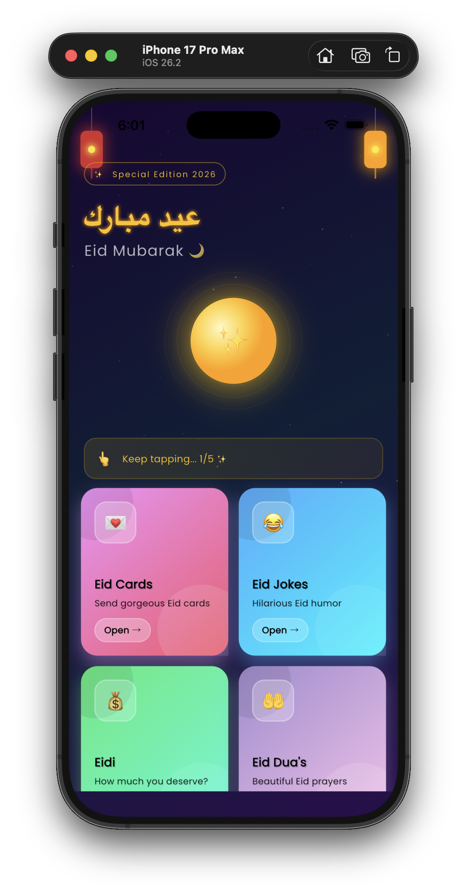
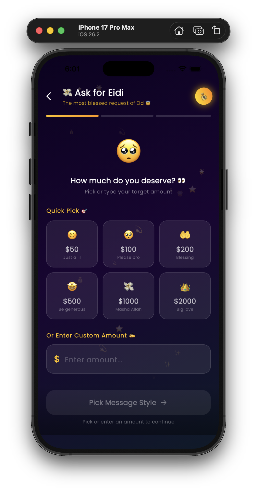
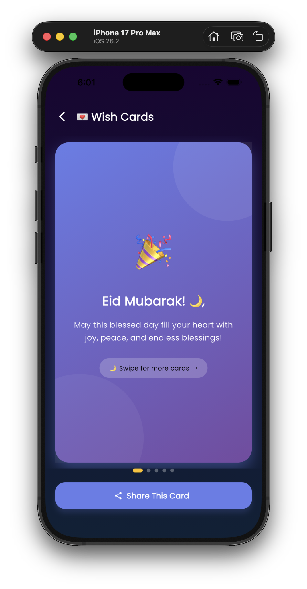
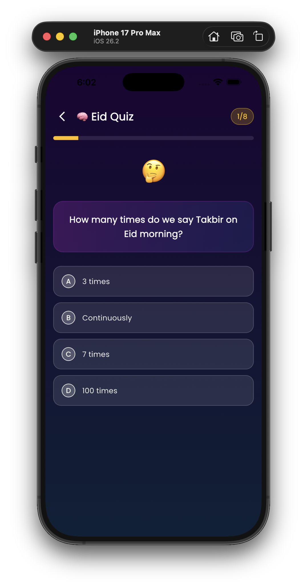
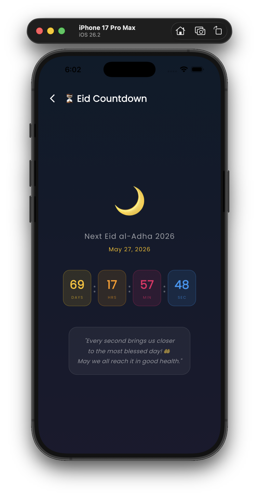
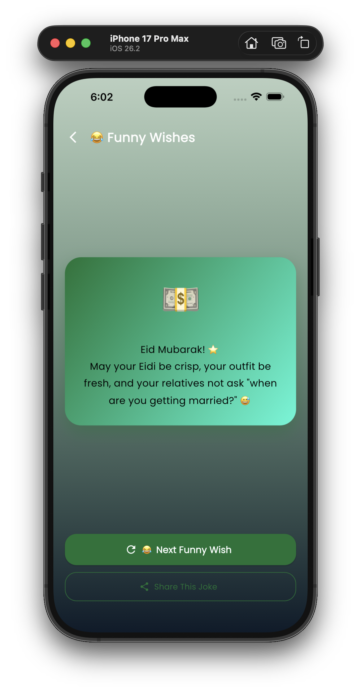

<div align="center">

# 🌙 Eid Celebrations
### *The most fun & interactive Eid app you'll ever use!*


<br/>

> **Send wishes. Request Eidi. Play games. Make memories.**
> *Everything you need for the perfect Eid — in one app.*

<br/>

[Features](#-features) • [Screenshots](#-screenshots) • [Installation](#-installation) • [Tech Stack](#-tech-stack) • [Contributing](#-contributing)

</div>

---

## ✨ What is Eid Celebrations?

**Eid Celebrations** is a beautifully designed Flutter app that brings all the joy, laughter, and spirituality of Eid into one place. Whether you want to send heartfelt wishes, request Eidi in the funniest way possible, test your Islamic knowledge, or just count down to the big day — we've got you covered!

Built with **Flutter** + **love** + **a lot of humor** 😂

---

## 🎯 Features

### 💌 Wish Cards
> Send gorgeous, swipeable Eid greeting cards to your loved ones

- Beautiful animated cards with rich gradients
- Multiple design themes to choose from
- One-tap sharing to WhatsApp, iMessage & more
- Personalize with custom names

---

### 💸 Ask for Eidi *(Fan Favorite!)*
> Request Eidi from family & friends in the most hilarious way possible

- **6 Unique Message Tones:**
  - 🥺 Ultra Emotional — *bring out the tears*
  - 😂 Pure Comedy — *make them laugh first, then pay*
  - 😇 Innocent Child — *small child energy activated*
  - 💼 Business Proposal — *very professional, very serious*
  - 🌹 Poet Mode — *Shakespeare would be proud*
  - 👨‍⚖️ Legal Notice — *this is legally binding*
  
- Choose preset amounts or enter custom amount
- Personalize with recipient's name
- One-tap share to any platform
- Spinning coin animation + confetti burst 🎊

---

### 😂 Funny Wishes
> Hilarious Eid humor that will make your family group chat explode

- Shake phone to get a new joke
- Share the funniest ones instantly
- New jokes added regularly
- Haptic feedback on every interaction

---

### 💰 Eidi Calculator
> Find out exactly how much Eidi you deserve (spoiler: a lot)

- Answer fun questions about yourself
- Get a calculated "deserved Eidi" amount
- Comes with a humorous breakdown
- Share your result and challenge friends

---

### 🤲 Duas Collection
> Beautiful Islamic prayers for Eid

- Handpicked Eid duas in Arabic + translation
- Copy to clipboard with one tap
- Clean, readable typography
- Share duas with family

---

### ⏳ Eid Countdown
> Live countdown to the next Eid (Eid al-Fitr 2026)

- Real-time days, hours, minutes, seconds
- Beautiful animated moon display
- Motivational messages as Eid approaches
- Never miss the big moment!

---

### 🧠 Eid Quiz
> Test your Islamic & Eid knowledge!

- **8 carefully crafted questions** about Eid
- Instant right/wrong feedback
- Confetti burst on correct answers 🎊
- Detailed explanations for every answer
- Score tracking with motivational results
- Progress bar to track your journey
- Haptic feedback throughout

---

## 📱 Screenshots

| Home Screen | Ask Eidi | Wish Cards |
|:-----------:|:--------:|:----------:|
|  |  |  |

| Eid Quiz | Countdown | Funny Wishes |
|:--------:|:---------:|:------------:|
|  |  |  |

> **Note for contributors:** Place your screenshots in the `/screenshots` folder at the root of the project.

---

## 🎬 Demo Video

> [](https://www.youtube.com/shorts/ZyfRJVvfqn4)

---

## 🛠 Tech Stack

| Technology | Purpose |
|-----------|---------|
|  | Cross-platform UI framework |
|  | Programming language |
| `flutter_animate` | Smooth, beautiful animations |
| `confetti` | Celebration confetti bursts |
| `share_plus` | Native share functionality |
| `google_fonts` | Beautiful typography |
| `shared_preferences` | Local data persistence |

---

## 📦 Installation

### Prerequisites
- Flutter SDK `>=3.0.0`
- Dart SDK `>=3.0.0`
- Android Studio / VS Code
- A device or emulator running Android 5.0+ / iOS 12.0+

### Steps

**1. Clone the repository**

**2. Navigate into the project**

**3. Install dependencies**

**4. Run the app**

**5. Build for release (Android)**

**6. Build for release (iOS)**

---

## 📁 Project Structure

```
eid_celebrations/
├── lib/
│   ├── main.dart                    # App entry point
│   └── screens/
│       ├── splash_screen.dart       # Animated splash screen
│       ├── home_screen.dart         # Main home with feature grid
│       ├── wish_cards_screen.dart   # Eid greeting cards
│       ├── ask_eidi_screen.dart     # Eidi request feature
│       ├── funny_wishes_screen.dart # Humor & jokes
│       ├── eidi_generator_screen.dart # Eidi calculator
│       ├── dua_screen.dart          # Islamic duas
│       ├── countdown_screen.dart    # Eid countdown timer
│       └── eid_quiz_screen.dart     # Interactive quiz
├── screenshots/                     # App screenshots for README
├── pubspec.yaml                     # Dependencies
└── README.md                        # You are here!
```

---

## 🤝 Contributing

Contributions are what make the open-source community amazing! Any contributions you make are **greatly appreciated**.

1. **Fork** the repository
2. Create your feature branch
   ```bash
   git checkout -b feature/AmazingFeature
   ```
3. Commit your changes
   ```bash
   git commit -m "Add some AmazingFeature"
   ```
4. Push to the branch
   ```bash
   git push origin feature/AmazingFeature
   ```
5. Open a **Pull Request**

### 💡 Ideas for Contributions
- [ ] Add Urdu language support
- [ ] Add more Eid duas
- [ ] Add Eid recipes section
- [ ] Add more quiz questions
- [ ] Dark/light theme toggle
- [ ] Add more Eidi message tones
- [ ] Push notifications for Eid countdown

---

## 🌟 Show Your Support

If this project made you smile or helped you celebrate Eid better:

- ⭐ **Star this repo** — it means the world!
- 🍴 **Fork it** and make it your own
- 📢 **Share it** with your friends & family
- 🐛 **Report bugs** so we can fix them

```
May Allah accept our good deeds, forgive our sins,
and make this Eid a source of joy for all. Ameen 🤲
```

---

## 📄 License

Distributed under the **MIT License**.
See `LICENSE` for more information.

---

## 👨‍💻 Author

**Usaid Asif**
> Building things that make people smile 😊

[](https://www.linkedin.com/in/usaid--asif/)

---

<div align="center">

**Made with 💛 for every Muslim celebrating Eid**

*Eid Mubarak! 🌙✨*

</div>
